# Parte 1 - Investigación sobre el cifrado Atbash

## ¿Qué es el cifrado Atbash?

El cifrado Atbash es un método de cifrado por sustitución simple utilizado en la criptografía clásica. Este sistema sustituye cada letra del alfabeto por su opuesta en un alfabeto invertido. Por ejemplo, la letra "A" se convierte en "Z", la "B" en "Y", y así sucesivamente.

El cifrado Atbash tiene sus raíces en la cultura hebrea antigua y se utilizó para codificar textos en manuscritos religiosos. Aunque su simplicidad lo hace fácilmente descifrable, jugó un papel importante como precursor en la historia de la criptografía.

### Historia

El nombre "Atbash" proviene de las dos primeras y las dos últimas letras del alfabeto hebreo: **Alef-Tav-Bet-Shin**. Este cifrado fue usado principalmente en textos religiosos para ocultar significados sensibles o añadir una capa de complejidad a ciertos escritos. Con el tiempo, su propósito práctico disminuyó debido a su falta de seguridad, pero dejó un impacto histórico importante.

## Ejemplo de aplicación

A continuación, se muestra un ejemplo sencillo de cómo se utiliza el cifrado Atbash para transformar un mensaje:

- **Texto original:** "HELLO"

- **Alfabeto original:**
A B C D E F G H I J K L M N O P Q R S T U V W X Y Z

- **Alfabeto invertido:**
Z Y X W V U T S R Q P O N M L K J I H G F E D C B A

- **Transformación del mensaje:**  
 "H" se convierte en "S"  
 "E" se convierte en "V"  
 "L" se convierte en "O"  
 "L" se convierte en "O"  
 "O" se convierte en "L"  

- **Texto cifrado:** "SVOOL"

## Razón para elegir este cifrado

Se eligió el cifrado Atbash por su simplicidad y importancia histórica como uno de los métodos criptográficos más antiguos documentados. A pesar que no es útil en la criptografía moderna debido a su facilidad en ser descifrado, su estudio es fundamental para comprender los inicios de esta disciplina y es un ejemplo claro de como se puede cifrar un mensaje con algo tan simple como un alfabeto.

### Ventajas

1. **Fácil de implementar:** Solo requiere invertir el alfabeto para cifrar y descifrar.
2. **Histórico:** Es un ejemplo temprano y representativo de la criptografía en civilizaciones antiguas.
3. **Reversible:** El proceso para cifrar y descifrar es exactamente el mismo.

### Vulnerabilidades

1. **Falta de seguridad:** Al ser un cifrado por sustitución simple, puede romperse fácilmente mediante análisis de frecuencia o inspección directa.
2. **Limitado a alfabetos específicos:** No funciona de forma nativa con alfabetos que contienen caracteres especiales o acentos.
3. **No utiliza claves:** Cualquier persona que conozca el método puede descifrar el mensaje sin necesidad de información adicional.

## Bibliografía

- [Cifrado Atbash - CipherSOnline](https://ciphersonline.com/es/cifrado-atbash)
- [Criptografía - CodePyMaster](https://www.codepymaster.com/criptografia/cifrado/atbash/)

# Parte 2 - Scripts con chats para obtenerlos

## Ejercicio 1

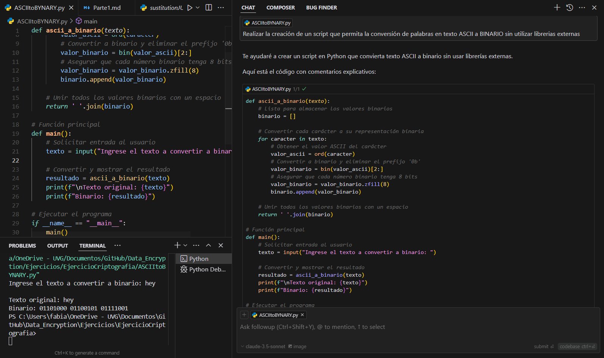
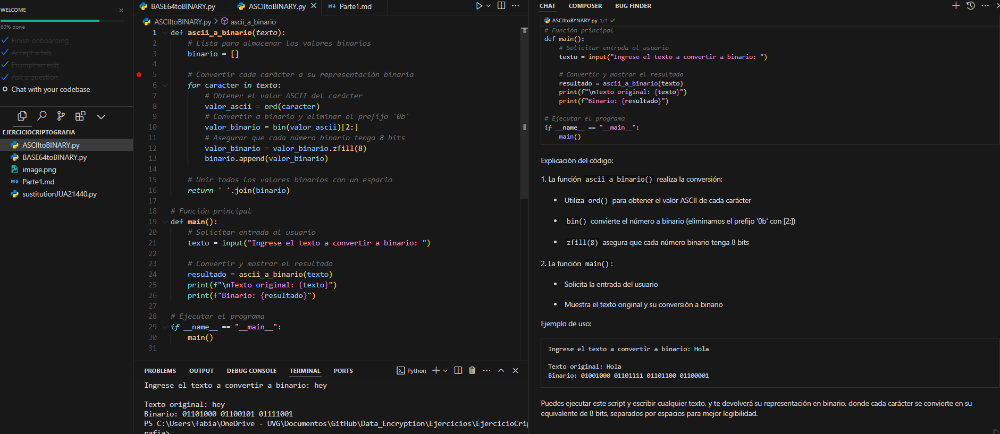
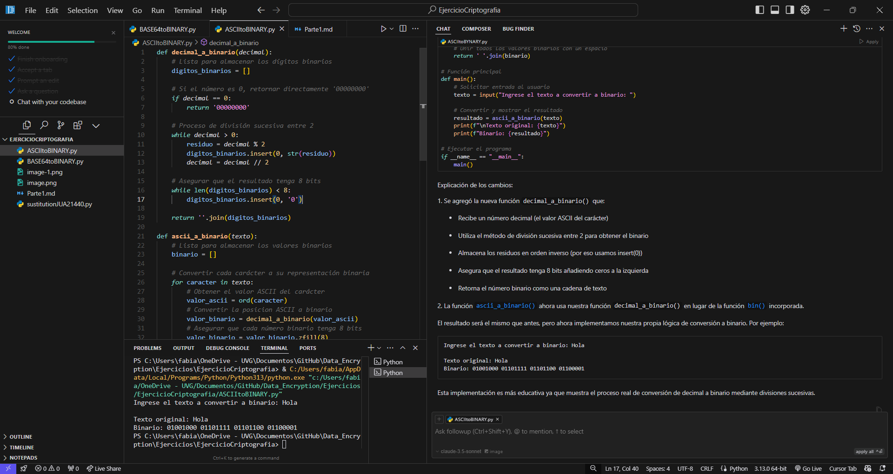

## Ejercicio 2

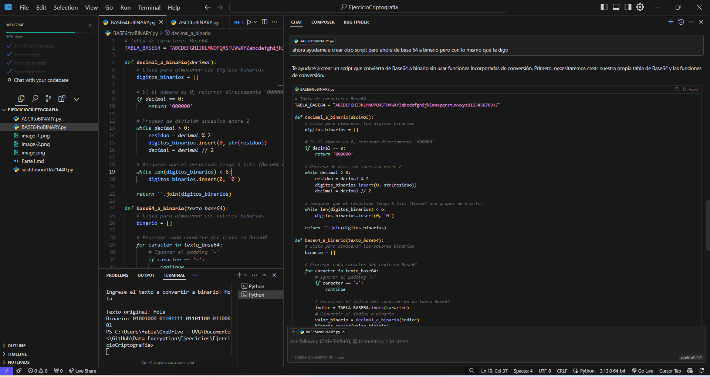
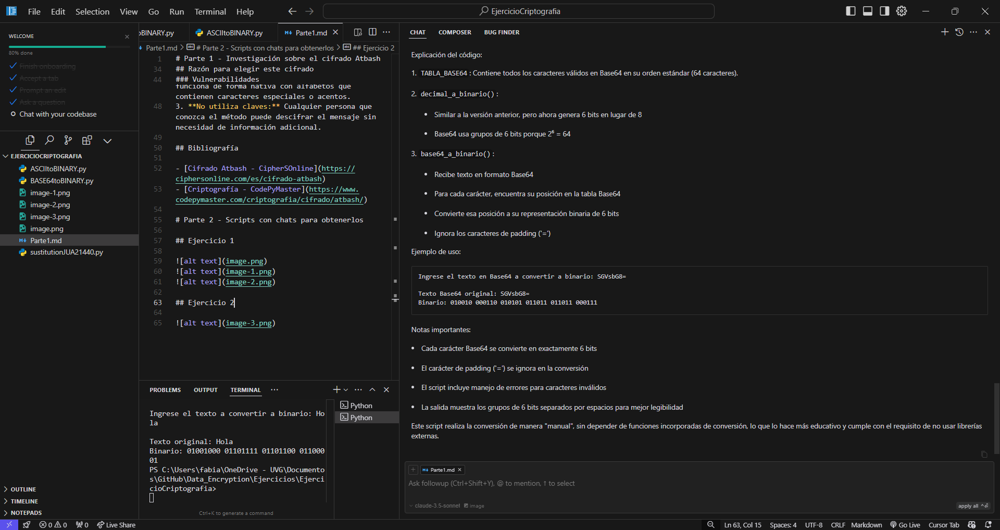

## Ejercicio 3

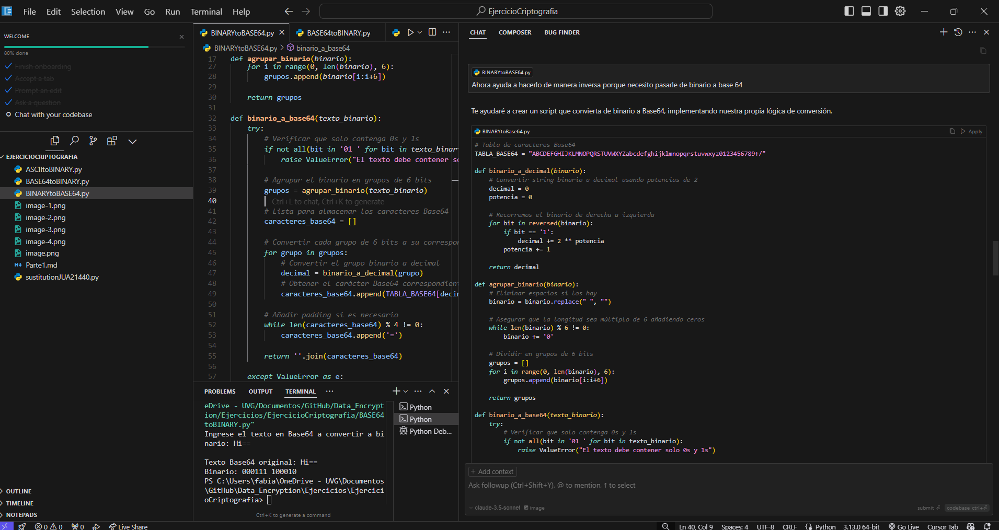
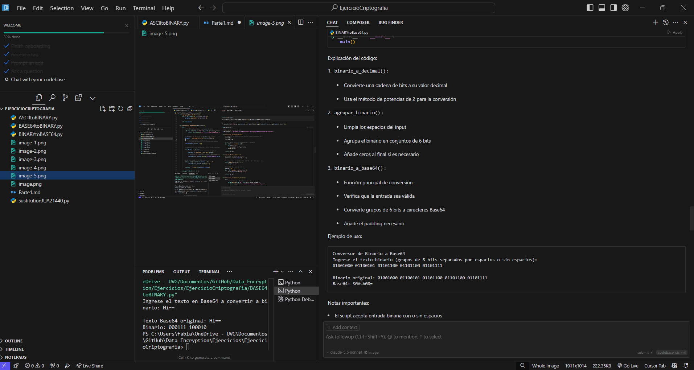
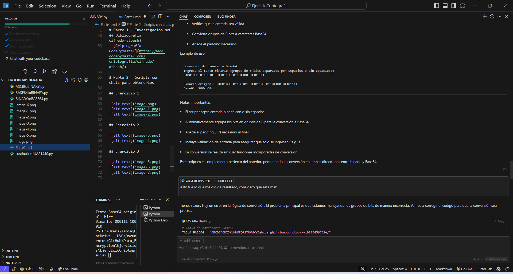

## Ejercicio 4

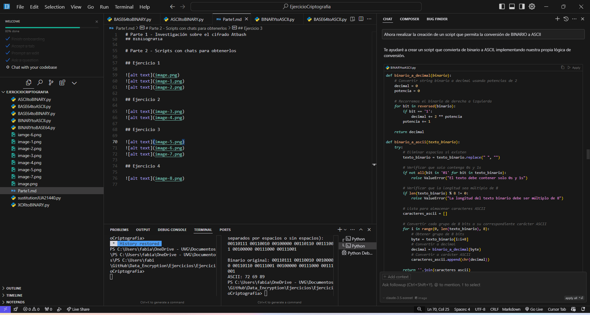
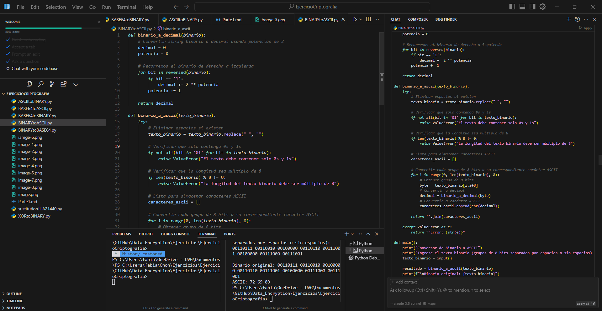

## Ejercicio 5

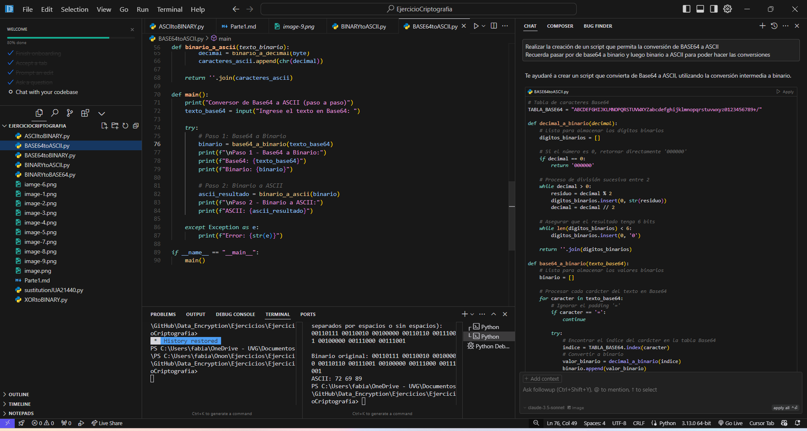
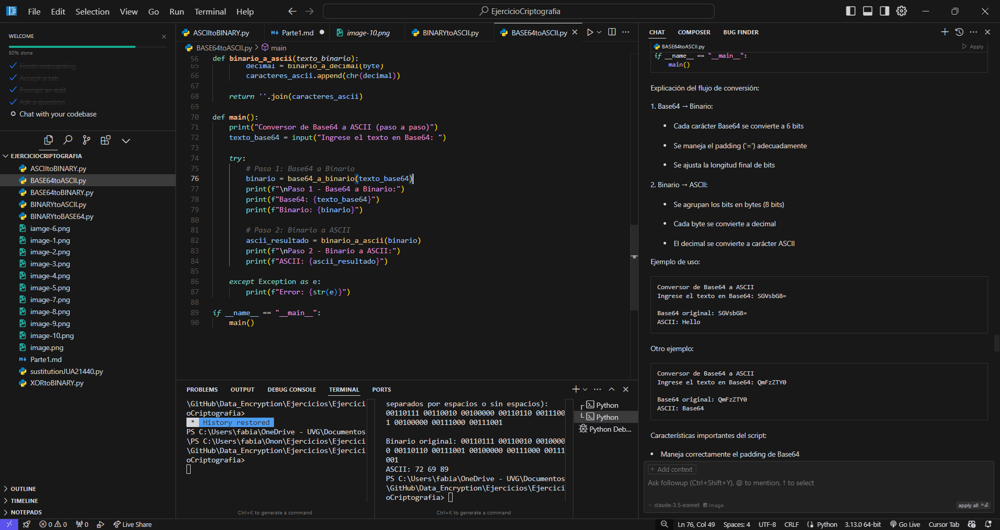

## Ejercicio 6

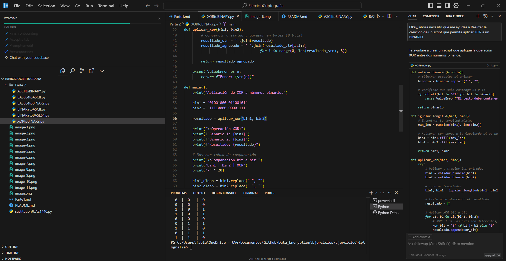

## Ejercicio 7

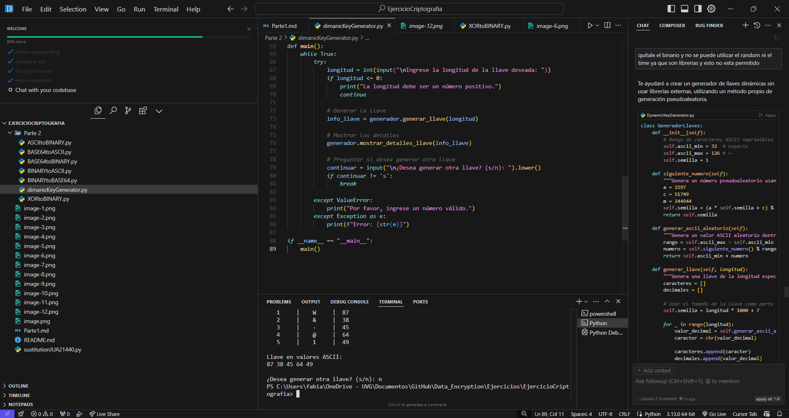
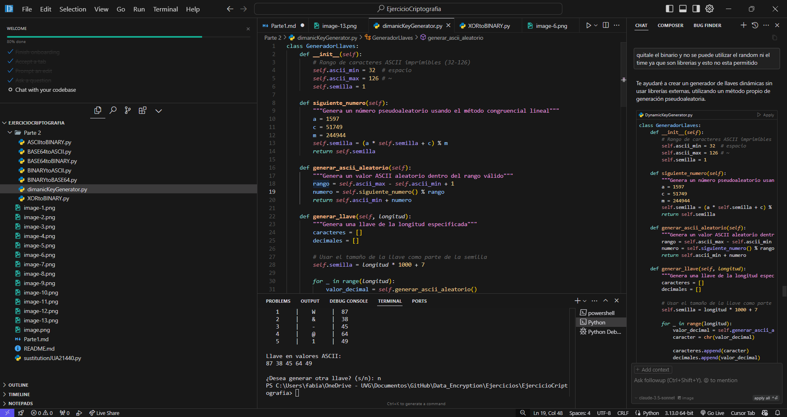

## Ejercicio 8
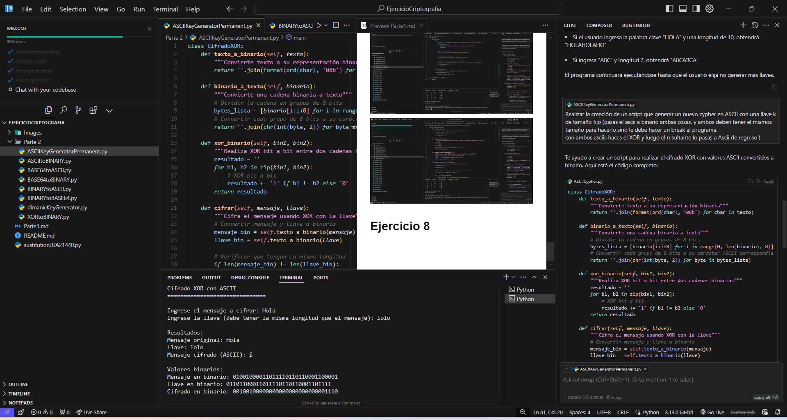

## Ejercicio 9
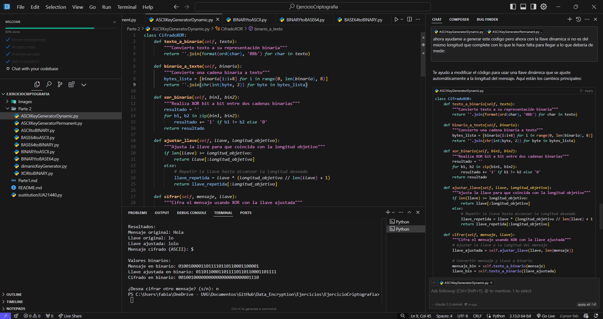
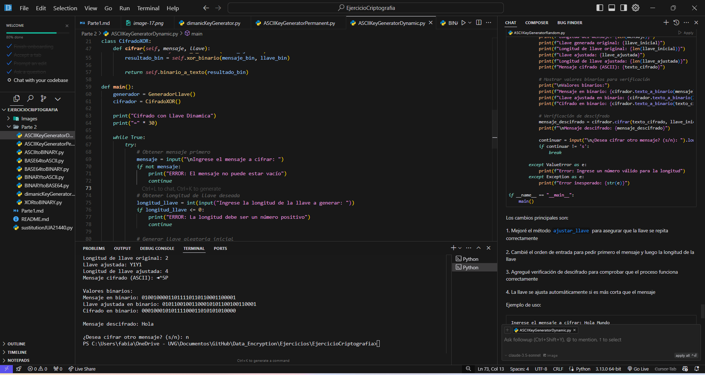