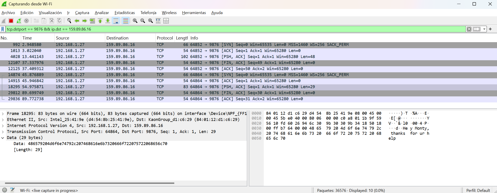

# Laboratorio Cifrados Simetricos

## 📜 Descripción


## ✨ Características
- 

## 📦 Dependencias Principales
Las principales dependencias del proyecto incluyen:
* [![Python][Python]][Python-url]
* [![Markdown][Markdown]][Markdown-url]

## 👥 Developer

* [![Linkedin][Linkedin]][Linkedin-fabian]
* [![GitHub][GitHub]][GitHub-fabian]

## 📖 Ejercicios
### Parte 1
Imagen Original


1. ¿Por qué el cifrado ECB revela los patrones de la imagen?
- ECB cifra cada bloque de datos de forma independiente con la misma clave. Esto significa que si hay bloques de datos idénticos en el archivo original, los bloques cifrados también serán idénticos. En una imagen, donde los píxeles con el mismo color pueden repetirse en patrones, el resultado del cifrado ECB mantiene la estructura de la imagen, revelando patrones reconocibles esto pasa mayoritariamente si los colores de la imagen son bastante opuestos.


2. ¿Cómo cambia la apariencia con CBC?
- CBC utiliza un vector de inicialización (IV) para llevar a cabo una cadena de los bloques de datos. Cada bloque cifrado depende del bloque anterior, lo que introduce aleatoriedad a pesar que los bloques iniciales sean los mismos. Esto rompe los patrones y produce una apariencia completamente aleatoria en la imagen cifrada, ocultando cualquier estructura reconocible.


3. ¿Qué tan seguro es usar ECB para cifrar datos estructurados?
- ECB es demasiado inseguro para cifrar, datos como imágenes o archivos con patrones repetitivos, porque no oculta la estructura de los datos originales. Los atacantes pueden identificar patrones y llevar a cabo a taques de fuerza bruta para encontrar la clave de cifrado de manera sencilla y también, pueden deducir información sin necesidad de descifrar completamente los datos. Por esta razón, ECB no es recomendado para información sensible; en su lugar, se prefieren modos como CBC en este caso.


```
Tobias, E. (2022). Zero Trust data-level security and key management. Ubiq. https://www.ubiqsecurity.com/ecb-vs-cbc-block-cipher-mode-differences/
```

### Parte 2
Captura de paquetes con mensaje Cifrado:


Captura de paquetes con mensaje sin cifrado:


1. ¿Se puede identificar que los mensajes están cifrados con AES-CBC?
    
    En la captura de Wireshark, los datos en el campo Data aparecen como una secuencia de bytes en hexadecimal sin un patrón reconocible, lo que sugiere que están cifrados. Sin embargo, no hay una indicación directa de que se haya usado AES-CBC, se podrían realizar los siguientes análisis:

    1. Longitud del bloque: AES-CBC trabaja con bloques de 16 bytes (128 bits). Si el tamaño de los datos es un múltiplo de 16 y hay relleno (padding), esto podría indicar su uso.
    2. Estructura de los datos cifrados: En AES-CBC, los primeros 16 bytes suelen ser el vector de inicialización (IV). Si los primeros bytes cambian en cada mensaje pero el tamaño es constante, es una pista de AES-CBC.
    3. Análisis de patrones: Si fuera AES-ECB, podríamos ver patrones repetidos, lo que podría indicar el uso de un modo más seguro como CBC o GCM.

2. ¿Cómo podríamos proteger más esta comunicación?

    Para mejorar la seguridad de la comunicación, se pueden implementar las siguientes medidas:

    1. Uso de AES-GCM en lugar de AES-CBC
    - AES-GCM proporciona confidencialidad y autenticación, evitando ataques como el Padding Oracle Attack, al cual AES-CBC puede ser vulnerable si no se maneja correctamente.
    2. Implementar TLS en la comunicación
    - Si esta comunicación es entre un cliente y servidor, usar TLS garantizaría cifrado de extremo a extremo con un protocolo seguro.

    3. Rotación de claves y manejo seguro de IVs
    - En AES-CBC, el IV no debe repetirse para evitar ataques criptográficos.
    - Las claves deben cambiarse periódicamente y almacenarse de forma segura.

```
Digital, I. L. (2025). ¿Cómo funciona el cifrado AES? Funcionamiento y características. Whitestack. https://whitestack.com/es/blog/cifrado-aes/
Prácticas recomendadas de cifrado generales - AWS Guía prescriptiva. (s. f.). https://docs.aws.amazon.com/es_es/prescriptive-guidance/latest/encryption-best-practices/general-encryption-best-practices.html
```

### Parte 3
Resultado:
- Tiempo de ChaCha20: 0.001008 segundos, Memoria usada: 22287 bytes
- Tiempo de AES-CBC: 0.000202 segundos, Memoria usada: 24127 bytes

1. ¿Analizar que cifrado es mas rápido ChaCha20 o AES?
    En la prueba AES-CBC fue más rápido que ChaCha20 en términos de tiempo de ejecución, a pesar de ello el rendimiento puede variar en base al hardware y la implementación.

2. ¿En qué casos debería usarse en vez de AES?
    ChaCha20 es una alternativa de AES en algunos escenarios donde AES no es la mejor opción.
    - Cuando no se posee aceleración de hardware  ya que AES es rápido en CPUs modernas con instrucciones AES-NI, pero en dispositivos que no poseen esta optimización ChaCha20 es más rápido porque usa solo operaciones de suma, rotación y XOR.
    - AES en modo CBC es vulnerable a ataques de padding si no se manejan de manera correcta.
    - AES en modo CTR o GCM puede ser peligroso si se reutiliza un nonce.
    - ChaCha20, al no depender de tablas de búsqueda como AES, es más resistente a ataques por canales laterales como cache timing attacks.

```
NordPass. (s. f.). XChaCha20 encryption vs. AES-256: What’s the difference? https://nordpass.com/blog/xchacha20-encryption-vs-aes-256/
```

### Parte 4
1. ¿Cómo podríamos evitar ataques de ransomware?
- Realizar copias de seguridad regularmente. 

- Mantener el software actualizado. 

- Utilizar autenticación multifactor.

- Educarnos en los ataques mas comunes y en los que estoy más expuesto.

- Implementar soluciones de seguridad robustas como firewalls, software antivirus, entre otros.

```
Cómo prevenir los ataques de ransomware. (2025). Cloudflare. https://www.cloudflare.com/es-es/learning/security/ransomware/how-to-prevent-ransomware/?utm_source=chatgpt.com
```
2. ¿Qué tan importante es almacenar claves de manera segura?

El poder almacenar las claves de manera segura es lo mas importante para mantener la confidencialidad e integración de la información. Si estas claves se comprometen, los datos protegidos por ellas pueden ser accesibles de manera fácil. Algo que nos puede ayudar a que las claves se vuelvan aun mas seguras es gestionar un ciclo de vida en las claves, utilizar un hardware seguro y monitoreo continuo de actividades sospechosas en mi equipo.


```
Ibm. (2024). Gestión de claves. IBM. https://www.ibm.com/mx-es/topics/key-management
```

## 🤖 Uso de IA
* Se utilizó Claude 3.5 Sonnet y se evidencia por medio de las capturas de pantalla en la parte 1.


<!-- MARKDOWN LINKS & IMAGES -->
[Python]: https://img.shields.io/badge/Python-4B8BBE?style=for-the-badge&logo=python&logoColor=white
[Python-url]: https://www.python.org
[Markdown]: https://img.shields.io/badge/Markdown-000000?style=for-the-badge&logo=markdown&logoColor=white
[Markdown-url]: https://www.markdownguide.org
[Linkedin-fabian]: https://www.linkedin.com/in/fabianjua/
[Linkedin]: https://img.shields.io/badge/LinkedIn-0077B5?style=for-the-badge&logo=linkedin&logoColor=white
[Github-fabian]: https://github.com/FabianJuarez182/
[GitHub]: https://img.shields.io/badge/github-%23121011.svg?style=for-the-badge&logo=github&logoColor=white